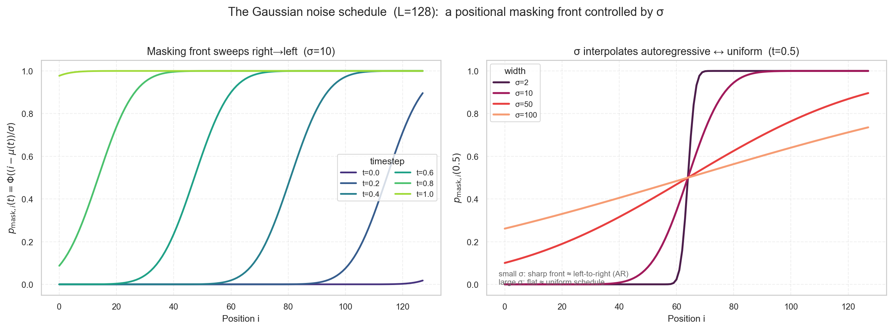
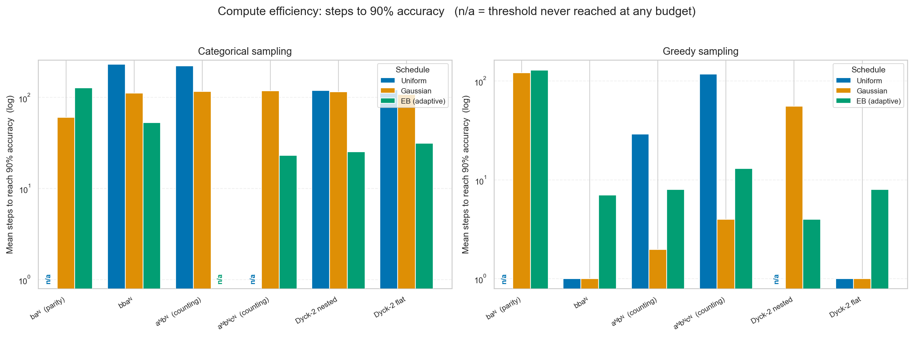

# The Sampler's Fault

**How compute, schedule, and sampling govern discrete diffusion on formal languages**

Kseniia Strelbytska · Stephen Perse Cambridge · IAI²O AI4Sci (Natural & Applied Science: Mathematics)

📄 [Paper (PDF)](https://drive.google.com/file/d/1o0ygvkFQ50PaqJwOlPyEKHrjIWUEwWhb/view?usp=sharing) ·
📊 [Quad chart](https://drive.google.com/file/d/1bnIZ6wN1F3nelrpkG47VLKJhXJvSlKZr/view?usp=sharing) ·
✍️ Typst sources: `paper/paper.typ`, `paper/quad_chart.typ`

**Status: complete.** The paper and quad chart are final and submitted. This repository holds the
oracle models, the Gaussian schedule, the full sweep pipeline, the real-model (CoDA-1.7B) validation,
and the figure-generation code behind every number in the paper.

---

## TL;DR

- **Replaced the denoiser neural network with a mathematically exact oracle** and isolated the
  sampling error. With learning error driven to zero, diffusion still fails on formal grammars — so
  a substantial part of the failure is intrinsic to *sampling*, not learning.
- **Designed a novel position-dependent Gaussian noise schedule** giving a **2–4× compute
  efficiency** improvement. It beats the classical uniform schedule on **every** grammar in at least
  one sampling regime, at no cost in diversity under categorical sampling (peak gain **+0.38**
  absolute accuracy at T = 16).
- **Validated on CoDA-1.7B-Instruct / HumanEval**: Gaussian beats uniform by **+58%** relative at
  T = 32 and **+94%** at T = 128 pass@1, confirming the oracle findings transfer to a real
  masked-diffusion code model.

---

## The question

Diffusion language models generate tokens in parallel, which makes them far cheaper than
autoregressive models — but they break formal syntax more often. In natural language, two
independently chosen tokens that disagree can usually be repaired by the rest of the sentence. In a
formal grammar, one misplaced token makes the string invalid with no path back.

When a diffusion model emits an invalid string, the cause is ambiguous:

> Did the **network** fail to learn the language, or did the **sampler** fail to make independently
> chosen tokens agree?

The two failures need opposite fixes (more data and better models vs. better schedules and
samplers), so they must be separated before either can be addressed.

| # | Research question |
|---|---|
| **RQ1** | With a perfect denoiser, do diffusion samplers still fail on formal grammars — i.e. is the failure intrinsic to sampling rather than learning? |
| **RQ2** | How do compute, the denoising schedule, and the sampling rule set the accuracy reached; how severe is the accuracy–diversity trade-off; and does grammar structure come into play? |
| **RQ3** | Can a position-aware schedule that injects an autoregressive-like ordering bias improve the accuracy–compute frontier over the standard uniform schedule? |

---

## Method

### 1. The oracle: a mathematically exact denoiser

For a partially masked input `S`, the oracle returns `D ∈ [0,1]^(L×V)` where `D[i,j]` is the **exact
fraction of grammatically valid completions of `S` that place token `j` at position `i`**. No learned
model can do better, so every error left in the pipeline belongs to the sampler.

Each language needs its own counting algorithm (`src/oracle/grammar_oracles.py`, plus
`src/oracle/deterministic_token_distribution.py` for L3). Every oracle is checked against exhaustive
brute-force enumeration on short sequences (`tests/test_grammar_oracles*.py`).

| Paper | Code name (`data.grammar`) | Category | Rules | Oracle method | Complexity |
|---|---|---|---|---|---|
| L1 | `baN` | regular | #a even; starts with b | per-length parity counting (closed form) | O(L²) |
| L2 | `bbaN` | regular | #a even; b's before a's | difference-array sweep over layouts | O(L²) |
| L3 | `aNbN` | context-free | #a = #b; a's before b's | bounded length-mixing with prefix sums | O(L²) |
| L4 | `parentheses_and_brackets` | context-free | paired **and nested** `[]` and `()` | interval (CYK-style) DP | O(L⁵) |
| L5 | `aNbNcN` | context-sensitive | #a = #b = #c; a's before b's before c's | per-length triple-block counting | O(L²) |
| L6 | `not_nested_parentheses_and_brackets` | context-sensitive | `[]` and `()` each balanced independently | forward–backward two-counter state DP | O(L⁴) |

The O(L⁵)/O(L⁴) oracles are why L4 and L6 are evaluated at L = 32, and the four O(L²) languages at
L = 128.

### 2. The Gaussian noise schedule (our contribution)

Under the standard uniform schedule, early-revealed positions are scattered at random and lack local
context. We instead make the masking probability **increase from left to right**, so suffix positions
are revealed after prefix positions and every newly revealed token has prefix context — an
autoregressive-like ordering that keeps generation parallel:

```
W = L + 4σ,   μ(t) = (1 − t)·W − 2σ,   p_mask,i(t) = Φ((i − μ(t)) / σ)
```

A single width parameter **σ** sets the sharpness of the reveal front: small σ = sharp front, strong
left-to-right bias; large σ = gradual, near-uniform front.



Implementation: `src/schedules/gaussian_schedule.py` (schedule), `src/schedules/decoding_strategy.py`
(position selection), `src/schedules/sampling_strategy.py` (greedy / categorical).

### 3. The experimental grid

| Axis | Values |
|---|---|
| Languages | L1–L6, spanning the Chomsky hierarchy (L = 128, or L = 32 for L4/L6) |
| Decoders | **autoregressive** (accuracy ceiling), **uniform** (standard), **entropy-bounded (EB)** (adaptive baseline), **Gaussian** (ours) |
| Samplers | greedy (argmax) vs. categorical (draw from the marginal) |
| Compute | T ∈ {1, 2, …, 512} at L = 32, up to 1024 at L = 128; reported as *realised mean denoising steps* (NFE) |
| Hyperparameters | Gaussian σ ∈ {1, 2, 5, 10, 20, 50, 100, 256}; EB γ ∈ {0.1, 0.5, 0.9, 2, 5, 10} |
| Per cell | 500 samples × 5 repetitions |

**Metrics.** *Both-rules-with-format accuracy* (satisfies both grammar rules **and** the canonical
SOS/content/EOS/PAD layout), a per-language diversity metric (uniqueness or n-coverage, chosen by
discriminative power at that length — `src/diversity_metrics.py`), and 95% **Wilson score intervals**
throughout, which stay well-behaved when a cell saturates at 0 or 1.

### 4. Real-model validation

The oracle isolates sampling *by construction*, so the findings are stress-tested on a real
pre-trained masked-diffusion code model: **CoDA-1.7B-Instruct** on **HumanEval** (164 tasks, scored
with EvalPlus), L = 128, T ∈ {32, 128}. The schedule/sampler code is ported 1:1 from
`src/schedules/` into `src/realmodel/schedules.py` and driven by a single decoding loop, so 1 forward
pass = 1 NFE for every decoder and the comparison is fair.

---

## Results

### RQ1 — the failure is intrinsic to sampling

The autoregressive decoder with the exact oracle reaches **1.000** both-rules accuracy on all six
grammars (which also verifies every oracle). The classical decoder of vanilla discrete diffusion
(uniform + categorical) needs **T ≥ 128** steps to reach 90% accuracy on any grammar, and **T = 512**
on L1, L3 and L5. Parallel generation only pays off when T < L — exactly the regime where accuracy is
guaranteed to fall below 90%. Since the denoiser is perfect, this gap is the sampler's.

### RQ2 — four sources of sampling error

| Lever | Effect |
|---|---|
| **Compute** | Helps monotonically, but only reaches the ceiling sooner — it never raises it. |
| **Schedule** | Sets compute efficiency, not the accuracy ceiling: EB ≻ Gaussian ≻ uniform. |
| **Sampling rule** | Sets the accuracy–diversity trade-off: greedy buys accuracy by collapsing to one string (diversity ≈ 0); categorical stays accurate *and* diverse at a compute cost. |
| **Grammar structure** | Picks the schedule: local constraints prefer a wide front, long-range counts and parity a sharp one. |



No decoder wins everywhere. EB is the most compute-efficient and matches the Gaussian ceiling on four
of six grammars, but its local entropy signal misses global counts: on L3 it stalls at **0.620** where
the Gaussian schedule reaches **0.992**.

The mechanism behind the greedy/categorical split is visible directly in the oracle marginals: where
the per-position profile is sharp and monotone, greedy commits correctly in a few steps; where a
global constraint leaves interior positions near ½, greedy's one-shot argmax must guess
(`paper_figures/fig6_oracle_monotonicity.png`).

### RQ3 — the Gaussian schedule

Best accuracy reached by each schedule under categorical sampling, maximised over all budgets (and
over σ for Gaussian):

| Grammar | Uniform | Gaussian | Gain |
|---|---|---|---|
| L1 | 0.972 | 0.996 | **+0.024** |
| L2 | 0.976 | 0.992 | **+0.016** |
| L3 | 0.978 | 0.992 | **+0.014** |
| L5 | 0.974 | 0.994 | **+0.020** |
| L4 | 0.970 | 0.980 | **+0.010** |
| L6 | 0.988 | 0.990 | **+0.002** |

At maximum compute the two schedules have nearly converged, so the deltas are small but consistently
positive. The real advantage is in the few-step regime where diffusion earns its place: at **T = 16**
the gain on L3 is **+0.378** (uniform 0.092 → Gaussian 0.470), with L5 almost identical (+0.374).
Under greedy sampling with a sharp front, the counting grammars go from near-zero to near-perfect in
2–4 steps. The Gaussian does not lift the ceiling — it reaches a given accuracy with **2–4× fewer
denoising steps**.

The gain tracks grammar structure: largest on the parity and counting grammars, where a left-to-right
order holds a long-range count consistent, and negligible on L4, whose bracket constraint is already
local so the uniform schedule leaves little headroom to recover.

### Transfer to a real model (CoDA-1.7B-Instruct, HumanEval)

| Finding | Evidence |
|---|---|
| Calibration | CoDA's native confidence sampling: 49.4% pass@1 (published 54.3%); our sequential/AR decoder: 49.4% at mean 64 NFE |
| More compute helps (RQ2) | Gaussian-greedy 28.0% at T = 32 → 36.6% at T = 128 |
| Greedy is more compute-efficient (RQ2) | T = 32: 28.0% vs. 5.2% categorical (5.4×); T = 128: 36.6% vs. 12.4% (3.0×) |
| **Gaussian beats uniform (RQ3)** | T = 32: **28.0% vs. 17.7%** (+58% rel., σ = 8); T = 128: **36.6% vs. 18.9%** (+94% rel., σ = 2) |
| Optimal σ shrinks with compute | σ = 8 at T = 32 → σ = 2 at T = 128, approaching the AR-like sharp front |
| EB is Pareto-efficient | γ = 2 greedy: 24.4% at 22 mean steps, beating uniform's 17.7% at 32 steps |

**Takeaway: the advance of reliable diffusion-based coding and mathematical agents will come from
sampling, not training.**

### Limitations

The oracle is a ceiling, not deployable end-to-end accuracy; we study only the forward-only regime
(no re-masking); the two length regimes (128 and 32) are not compared at matched absolute compute;
and the real-model validation is one 1.7B model on one benchmark with a limited hyperparameter grid.

---

## Repository layout

```
discrete-diffusion/
├── src/
│   ├── oracle/               # ★ exact per-grammar oracles + sweep drivers
│   │   ├── grammar_oracles.py            # L1, L2, L4, L5, L6 marginals
│   │   ├── deterministic_token_distribution.py   # L3 marginals
│   │   ├── eval_oracle_T_sweep.py        # grammar × L × decoder × sampler × T × hyperparam
│   │   ├── eval_oracle_param_sweep.py    # hyperparameter grid at fixed T
│   │   └── eval_oracle_sweep.py          # oracle ceiling for a trained-model sweep
│   ├── schedules/            # ★ noise schedules, decoders, samplers
│   │   ├── noise_schedule.py             # p_mask / dp_mask ABC
│   │   ├── gaussian_schedule.py          # our position-dependent schedule
│   │   ├── categorical_schedule.py       # standard uniform schedule
│   │   ├── decoding_strategy.py          # schedule-driven vs. entropy-bounded selection
│   │   └── sampling_strategy.py          # greedy vs. categorical
│   ├── realmodel/            # ★ CoDA-1.7B-Instruct / HumanEval validation (see its README)
│   ├── datasets/             # grammar definitions, masking + evaluation datasets
│   ├── models/               # transformer variants for the training phase (see bottom)
│   ├── eval_scripts/         # checkpoint evaluation, token-distribution investigation
│   ├── diversity_metrics.py  # uniqueness, n/m-coverage, DFA coverage, ...
│   ├── noise_schedule_unmask.py  # the unmasking loop shared by every decoder
│   ├── analyse.py            # sweep analysis
│   └── main.py               # training / eval entry point
├── paper_figures/            # figure generation from the combined sweep CSV
├── paper/                    # Typst sources + final PDFs (paper, quad chart)
├── configs/                  # experiment configs (YAML)
├── results/                  # sweep outputs (T-sweep-*, combined_6_grammar.csv)
├── results_realmodel*/       # CoDA HumanEval outputs
├── tests/                    # oracle brute-force checks, decoupling, diversity, efficiency
└── archived/                 # superseded experiments
```

---

## Reproducing the results

```bash
python -m venv .venv && source .venv/bin/activate
pip install -r requirements.txt
export PYTHONPATH=src
```

**1 — Oracle sweep** (the headline grid; parallelised over cells):

```bash
python src/oracle/eval_oracle_T_sweep.py --config configs/config_oracle.yaml \
    --out-dir results/T-sweep-nonDyck --n-evals 5 --workers 28
```

Set `data.l: 32` and the Dyck grammars in the config for the L4/L6 runs. Per-run CSVs are combined
into `results/combined_6_grammar.csv`.

**2 — Figures.** `paper_figures/` is the single source of truth; every figure and number in the paper
comes from the one combined CSV:

```bash
python paper_figures/make_paper_figures.py
```

**3 — Real-model validation.** See [`src/realmodel/README.md`](src/realmodel/README.md) for the full
run order (sanity check → CoDA reproduction → pilot → full grid). Requires a GPU:

```bash
python -m realmodel.run_code_eval --benchmark humaneval \
    --decoders uniform gaussian eb ar --samplers greedy categorical \
    --nfes 32 128 --sigmas 2 8 32 --gammas 0.5 2 --out-dir results_realmodel
python -m realmodel.aggregate_results --benchmark humaneval \
    --out-dir results_realmodel --csv results_realmodel/humaneval_passk.csv
```

**4 — Tests** (oracles vs. brute force, decoder/sampler decoupling, diversity metrics):

```bash
PYTHONPATH=src pytest tests/ \
    --ignore=tests/test_anbn_does_satisfy_format.py --ignore=tests/test_anbn_eos.py
# 142 passed
```

The two ignored files are legacy `anbn` tests left behind by the `src/datasets/` package refactor and
no longer import.

---
---

# Appendix: training a diffusion model from scratch

The earlier phase of this project — and a large part of its total work — was **training** transformer
based discrete diffusion models on formal languages and comparing them against autoregressive
baselines on rule extrapolation and length generalisation. The paper's results deliberately replace
the trained denoiser with the exact oracle, so this pipeline is **not** on the path to the headline
findings. It is kept here because it is fully working, it produced the empirical confirmation that the
oracle setup is a meaningful model of real training, and it is the natural starting point for
extending this work to learned denoisers.

That phase investigated:

1. Whether a discrete diffusion model trained on a language defined as the **intersection of two
   rules** learns each rule, and how.
2. **Out-of-distribution generalisation** on prompts that violate one rule, against autoregressive
   transformer baselines.
3. **Length generalisation** to sequences longer than those seen during training.

Inspired by [Sequence Modelling with Discrete Diffusion](https://arxiv.org/pdf/2406.07524) and
[Compositional Generalisation on OOD Prompts in Language Models](https://proceedings.neurips.cc/paper_files/paper/2024/file/3d9ef68629089da055334c2d41dfcf93-Paper-Conference.pdf)
(NeurIPS 2024).

## Running experiments

Edit a config in `configs/` to specify your experiment parameters.

```bash
# Train (default config)
python src/main.py --config configs/config.yaml --mode train --save

# Evaluate a checkpoint
python src/main.py --config configs/config.yaml --mode eval

# Investigate token distributions
python src/main.py --config configs/config_investigation.yaml --mode investigate
```

| Argument      | Type   | Default                    | Description                          |
|---------------|--------|----------------------------|--------------------------------------|
| `--config`    | `str`  | `../configs/config.yaml`   | Path to the configuration file       |
| `--mode`      | `str`  | `train`                    | `train`, `eval`, or `investigate`    |
| `--save`      | flag   | `False`                    | Save model checkpoints and figures   |
| `--verbose`   | flag   | `False`                    | Enable verbose output                |
| `--schedule`  | `str`  | *(from config)*            | Override noise schedule: `categorical` or `gaussian` |
| `--sigma`     | float  | *(from config)*            | Override Gaussian sigma              |

## Grammar selection

Set `data.grammar` in your config to choose the training grammar. All grammars use token IDs:
**SOS=3, EOS=2, PAD=4, MASK=5**, with grammar content tokens starting at 0.

### Built-in grammars

| `data.grammar` | Description | `model.vocab_size` |
|----------------|-------------|-------------------|
| `anbn` | a^n b^n — equal counts, a's before b's | 6 |
| `initial` | Equal 0s and 1s, no alternating substrings | 6 |

### Formal grammar library (RE grammars)

These grammars come from the rule-extrapolation benchmark. The grammar rule is evaluated as a single
pass/fail check. The six used in the paper are marked with their paper label.

| `data.grammar` | Description | `model.vocab_size` |
|----------------|-------------|-------------------|
| `aNbN` | Same as `anbn` (a^n b^n via RE generators) — **L3** | 6 |
| `abN` | Equal a's and b's, any order | 6 |
| `baN` | Begins with b, even number of a's — **L1** | 6 |
| `bbaN` | b's before a's, even number of a's — **L2** | 6 |
| `aNbM` | a's before b's, any counts | 6 |
| `aNbNaN` | a^N b^N a^N pattern | 6 |
| `aNbNcN` | a^N b^N c^N — three equal-count sections — **L5** | 7 |
| `brackets` | Matched `[]` pairs | 8 |
| `parentheses` | Matched `()` pairs | 6 |
| `parentheses_and_brackets` | Nested matched `()` and `[]` — **L4** | 8 |
| `separated_parentheses_and_brackets` | Either `()` only or `[]` only per sequence | 8 |
| `not_nested_parentheses_and_brackets` | Non-nested matched `()` and `[]` — **L6** | 8 |

**Example config snippet for `aNbNcN`:**
```yaml
data:
  grammar: aNbNcN
  l: 60          # sequence content length; total seqs: l//3
model:
  vocab_size: 7  # must match grammar's vocab_size above
  max_len: 62    # l + 2
```

**Example for matched parentheses and brackets:**
```yaml
data:
  grammar: parentheses_and_brackets
  l: 64
model:
  vocab_size: 8
  max_len: 66
```

### Evaluation dataset types

For the `anbn` / `aNbN` grammar, structured prompt sets are available:

| `evaluation.eval_dataset` | Description |
|---------------------------|-------------|
| `limited` | In-distribution prompts (up to l/2 a's + some b's) |
| `randomised` | Random in-distribution prompts (default) |
| `complete` | Out-of-distribution prompts (longer than training) |
| `diffusion` | Noisy samples from training distribution |
| `unconditional` | Fully masked sequences — works with **any grammar** |

For RE grammars other than `aNbN`, use `eval_dataset: unconditional`.

## Config parameters

| Parameter | Type | Description |
|-----------|------|-------------|
| `seed` | int | Random seed for reproducibility |
| `device` | `auto` \| `cpu` \| `cuda` \| `mps` | Device to run training on |
| **data** | | |
| `data.l` | int | Max content length (sequences padded to `l+2`) |
| `data.train_split` | float | Fraction of data used for training |
| `data.batch_size` | int | Training batch size |
| `data.grammar` | str | Grammar type (see table above) |
| **model** | | Transformer model parameters |
| `model.architecture` | str | `classic`, `RPE`, `RPE_KQ`, `T5`, `FIRE`, `v2`, `autoregressive`, `RE`, `timestep`, `oracle` |
| `model.max_len` | int | Set to `l + 2` |
| `model.vocab_size` | int | Must match grammar (see table above) |
| `model.n_head` | int | Number of attention heads |
| `model.n_layers` | int | Number of transformer layers |
| `model.embed_dim` | int | Embedding dimension |
| `model.dim_feedforward` | int | Feed-forward layer dimension |
| `model.dropout` | float | Dropout rate |
| `model.T` | int | Number of denoising timesteps |
| `model.eos_weight` | float | EOS token loss weight (compensates for scarcity) |
| **training** | | |
| `training.epochs` | int | Number of training epochs |
| `training.learning_rate` | float | Learning rate |
| `training.loss_type` | `eq8` \| `eq9` | Loss variant |
| **schedule** | | Noise schedule |
| `schedule.type` | `categorical` \| `gaussian` | Schedule type (or use `--schedule` CLI flag) |
| `schedule.sigma` | float | Gaussian width (if using gaussian schedule) |
| **evaluation** | | |
| `evaluation.eval_every` | int | Evaluate every N epochs |
| `evaluation.n_samples` | int | Number of evaluation prompts |
| `evaluation.eval_dataset` | str | Prompt type (see table above) |
| `evaluation.eval_type` | `full` \| `random` | Use all prompts or a random subset |
| **paths** | | |
| `paths.models_dir` | str | Checkpoint directory (default `models`) |
| `paths.figures_dir` | str | Figures directory (default `figures`) |
| `paths.experiment_name` | str | Subdirectory name for this run |
| `notes` | str | Free-text experiment description |

## Expected outputs

```
outputs/
└── [experiment_name]/
    ├── models/
    │   ├── config_snapshot.yaml
    │   └── diffusion_epochs_500.pt
    └── figures/
        ├── plot.png
        └── loss_log.txt
```

- `models/[experiment_name]` — model weights saved every `evaluation.eval_every` epochs, plus a copy
  of the YAML config used for the run.
- `figures/[experiment_name]` — `plot.png`, a graph of the tracked accuracy metrics (rule 1, rule 2,
  both rules, format). Expect a line graph after `2 * evaluation.eval_every` epochs.

## Accuracy metrics used during training

Both the diffusion and the autoregressive pipelines track accuracy on:

- **Rule 1** — the two counts match (e.g. the number of 0s and 1s)
- **Rule 2** — the ordering holds (e.g. all 0s precede all 1s)
- **Both rules** — strings satisfying Rule 1 and Rule 2
- **Format** — the string follows `SOS[0s][1s]EOS[PAD]`, with exactly one SOS and one EOS

Evaluation prompts: diffusion uses `n_samples=100` drawn from the training data and randomly masked
with `0.8 ≤ masking_probability ≤ 1.0`; the autoregressive baseline uses `n_samples=100` from a
dataset containing `'0' * l` and `'0' * l + '1'` for all `1 ≤ l ≤ 128`.
